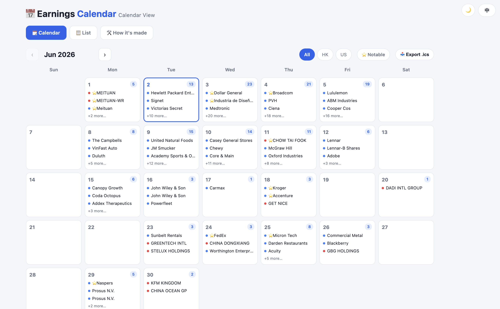

<div align="right">

**English** · [中文](README.zh-CN.md)

</div>

# 📅 Earnings Calendar

A lightweight, **bilingual (EN/中文)** earnings calendar for **US & HK** stocks — a single-file static web app you can open by double-clicking, with no server or build step required.


---

## ✨ Features

- **Two views**
  - 🗓️ **Calendar view** (`index.html`, default) — a month grid; click any day for a detail popup.
  - 📋 **List view** (`list.html`) — earnings grouped by day, with EPS / revenue estimates vs. actuals (beat/miss coloring) and earnings-call indicators.
- **Bilingual everything** — UI text **and company names** switch between Chinese and English. Language preference is remembered across pages.
- **Light / dark theme** — top-right toggle, also remembered.
- **Importance ranking** — each day is sorted by expected revenue; large caps (est. revenue ≥ 10B) get a ⭐ badge, with a **"⭐ Notable" filter** to show only the big ones.
- **Search & market filter** — filter by US / HK, search by company name (either language) or ticker.
- **Export to `.ics`** — one click exports the current (filtered) results as a calendar file you can import into Google / Apple / Feishu Calendar.
- **Quote links** — every company name links to its Longbridge quote page (locale-aware).
- **Auto "today"** — the current date is highlighted dynamically based on your local clock.

## 📸 Screenshots



## 📦 Project structure

```
.
├── index.html          # Calendar view (default) — data inlined
├── list.html           # List view — data inlined
├── about.html          # "How it's made" page
├── calendar_data.json  # Source data (bilingual fields)
└── build_pages.py      # Generator: reads calendar_data.json → renders the 3 HTML pages
```

## 🛠️ How it's built

Copy and send this to any AI — it will guide you through the installation:

```bash
Please install the Longbridge AI toolkit by following this guide:
https://open.longbridge.com/skill/install.md?invite-code=K3CL9B
After installing, complete the login authorization and query a stock quote to confirm it works.
```

After installing, send the following to generate the earnings calendar:

```bash
Using the longbridge skill to generate the earnings calendar.
```

## ⚠️ Disclaimer

Data comes from the Longbridge Finance Calendar and is provided **for reference only — it is not investment advice**. Earnings dates and estimates may change; always verify against official sources.

## 📄 License

MIT
