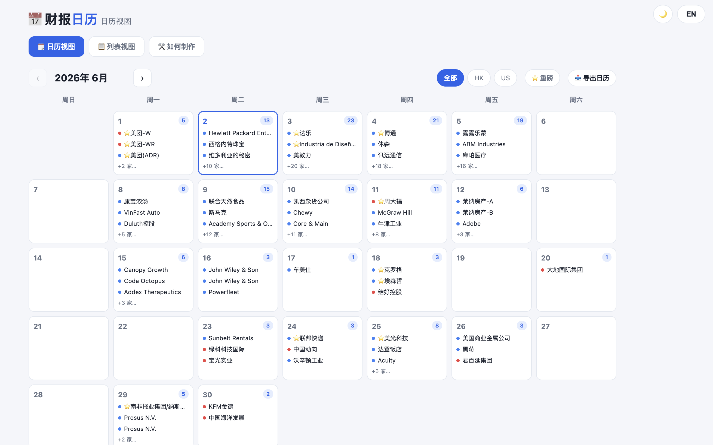

<div align="right">

[English](README.md) · **中文**

</div>

# 📅 财报日历 · Earnings Calendar

一个轻量、**中英双语**的**美股 & 港股**财报日历——单文件静态网页，双击即可打开，无需服务器、无需构建。


---

## ✨ 功能特性

- **两种视图**
  - 🗓️ **日历视图**（`index.html`，默认）——月历网格，点击任意日期弹出当日详情。
  - 📋 **列表视图**（`list.html`）——按日期分组的财报卡片，含 EPS / 营收的预期 vs 实际（beat/miss 配色）与电话会标记。
- **彻底双语**——界面文字**与公司名**均可中英切换，语言偏好跨页面记忆。
- **明 / 暗主题**——右上角一键切换，并记忆选择。
- **重要度排序**——每天按预期营收降序排列；大盘股（预期营收 ≥ 100 亿）标 ⭐，并提供**「⭐ 重磅」筛选**只看重磅公司。
- **搜索与市场筛选**——按 US / HK 筛选，按公司名（中/英）或股票代码搜索。
- **导出 `.ics`**——一键把当前（筛选后）结果导出为日历文件，可导入 Google / Apple / 飞书日历。
- **行情页链接**——每个公司名都链接到对应的长桥行情页（随语言切换）。
- **自动「今天」**——根据本地时间动态高亮当天日期。

## 📸 截图



## 📦 项目结构

```
.
├── index.html          # 日历视图（默认）—— 数据已内联
├── list.html           # 列表视图 —— 数据已内联
├── about.html          # 「如何制作」页面
├── calendar_data.json  # 源数据（含中英双语字段）
└── build_pages.py      # 生成脚本：读取 calendar_data.json → 渲染 3 个 HTML 页面
```


## 🛠️ 如何制作

复制下面的内容发送给任意 AI，一键安装：

```bash
请按照以下指南安装 Longbridge AI toolkit：
https://open.longbridge.com/skill/install.md?invite-code=K3CL9B
安装完成后，完成登录授权，查询一支股票行情确认可用。
```

安装后，发送以下指令生成财报日历：

```bash
调用 longbridge skill 生成财报日历。
```


## ⚠️ 免责声明

数据来源于长桥财经日历，**仅供参考，不构成投资建议**。财报日期与预期数据可能变动，请以官方披露为准。

## 📄 许可证

MIT
